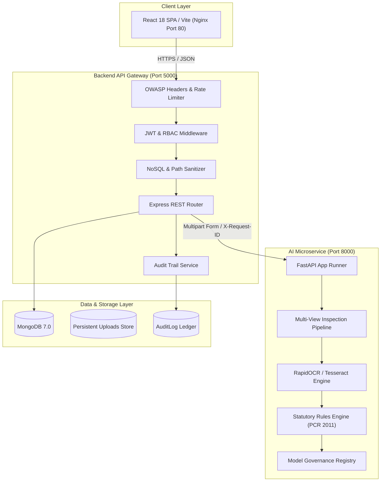

# PackCheck AI — Technical Architecture & Microservice Specification

**Version:** 2.2.0-Production | **Date:** September 9, 2026

---

## 1. System Topology

---

## 2. Distributed Idempotency & Latency Architecture

### In-Memory vs. Multi-Instance Distributed Idempotency
- **Single-Instance Deployment (Current Baseline)**: Request deduplication uses an in-memory TTL map (`idempotency.js`). Completed responses with `Idempotency-Key` headers are cached for 10 minutes.
- **Multi-Instance Architecture**: For horizontally scaled deployments across multiple backend instances, `idempotency.js` is designed to swap the internal memory `Map` with an atomic Redis store (`redis.set(key, val, 'EX', 600, 'NX')`).

### Latency Budget Breakdown
| Pipeline Stage | Target Median | Target P95 | Description |
| :--- | :---: | :---: | :--- |
| Gateway Overhead | 2ms | 5ms | Security middleware, auth, input validation |
| AI Computer Vision | 2,500ms | 4,000ms | Multi-view image classification & OCR text extraction |
| Statutory Rule Evaluation | 15ms | 30ms | PCR 2011 mandatory declaration verification |
| PDF Report Rendering | 25ms | 50ms | Hardened Puppeteer Chromium rendering |
| Total Inspection Flow | **2,550ms** | **4,100ms** | Complete end-to-end multi-image inspection |
