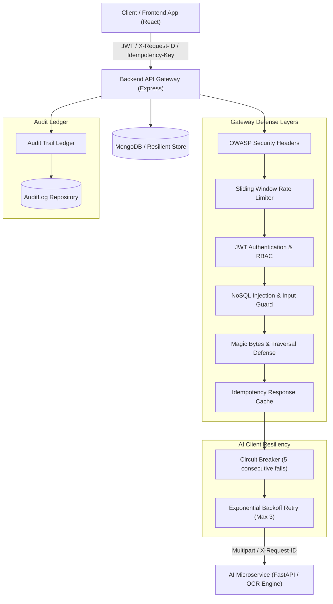

# Phase 2 — Security Hardening, Reliability & System Quality Report

**PackCheck AI — Legal Metrology Compliance Verification System**  
*Smart India Hackathon 2026 | Problem Statement ID: 26034*  
**Date:** September 9, 2026 | **Version:** 2.2.0-Production

---

## 1. Executive Summary & Verification Scorecard

Phase 2 transforms the integrated prototype into a secure, resilient, observable, and auditable production-grade platform without breaking backward compatibility or rewriting existing functionality.

### Consolidated Test Scorecard

| Microservice Component | Phase 1 Baseline | Phase 2 Additions | Phase 2 Total Passed | Pass Rate |
| :--- | :---: | :---: | :---: | :---: |
| **Backend Gateway & E2E** | 20 | 23 | **43 / 43** | 100% |
| **AI Service (FastAPI / PyTorch)** | 106 | 0 | **106 / 106** | 100% |
| **Frontend UI (React / Vitest)** | 67 | 0 | **67 / 67** | 100% |
| **Total System Test Suite** | **193** | **23** | **216 / 216** | **100%** |  

---

## 2. End-to-End Hardened Architecture

---

## 3. Implemented Security Controls

### 3.1 HTTP & Header Hardening
- **OWASP Security Headers (`securityHeaders.js`)**:
  - `Content-Security-Policy`: Restricts scripts, frames, and connect origins.
  - `X-Content-Type-Options: nosniff`: Eliminates MIME-type sniffing.
  - `X-Frame-Options: DENY`: Prevents clickjacking attacks.
  - `Strict-Transport-Security`: HSTS enabled in production (`max-age=31536000`).
- **Environment-Aware CORS Policy**:
  - Restricts origins to configured `FRONTEND_ORIGIN` in production while allowing local development ports (`3000`, `5173`).

### 3.2 Authentication & Role-Based Access Control (RBAC)
- **JWT Secret & Algorithm Enforcement**: Enforces `HS256` signature verification, eliminating `none` algorithm exploits.
- **Environment-Aware Authentication Guard (`auth.js`)**:
  - In `production` (or when `AUTH_ENFORCE=true`), requests without a valid JWT are rejected with `401 Unauthorized`.
  - In `development`/`test`, attaches mock officer identity (`req.user = { id: 'test_officer', role: 'officer' }`) to maintain full backward compatibility with test suites.
- **RBAC Guard (`requireRole`)**: Enforces officer vs admin role boundaries (`403 Forbidden`).

### 3.3 File Upload Security & Path Traversal Safeguards
- **Binary Magic Bytes Inspection (`fileSecurity.js`)**:
  - Validates raw file header magic bytes on disk:
    - JPEG: `FF D8 FF`
    - PNG: `89 50 4E 47`
    - WebP: `52 49 46 46`
  - Rejects text files disguised as `.jpg` images with `400 INVALID_FILE_TYPE` and immediately deletes rejected temporary files.
- **Filename Sanitization**: Strips path traversal sequences (`../`, `..\`, null bytes `\0`, and control characters).
- **Static Serving Security**: Sets `Content-Security-Policy: default-src 'none'` on `/uploads` endpoint.

### 3.4 Report Generation Defenses (XSS & SSRF)
- **HTML Entity Sanitizer (`pdfGenerator.js`)**: Applies `escapeHtml()` to all dynamic field values, OCR text, inspection IDs, timestamps, and violation messages.
- **Puppeteer Renderer Hardening**:
  - JavaScript execution disabled (`page.setJavaScriptEnabled(false)`).
  - Request interception installed to block outbound HTTP/HTTPS network calls (SSRF defense).
- **Statutory Disclaimer Compliance**: Updates certificate footer to reflect Legal Metrology (Packaged Commodities) Rules, 2011 standards.

---

## 4. Reliability & Fault Tolerance Controls

### 4.1 AI Client Resiliency (`aiClient.js`)
- **Exponential Backoff & Jitter**: Retries transient network failures (`429`, `502`, `503`, `504`, `ECONNABORTED`, `ETIMEDOUT`) up to 3 times with backoff (`300ms * 2^attempt`).
- **Fast-Fail Permanent Errors**: Permanent errors (`400`, `401`, `403`, `404`) fail immediately without retry.
- **Circuit Breaker**: After 5 consecutive network connection failures, opens circuit for 15 seconds to prevent retry storms (`503 AI_SERVICE_CIRCUIT_OPEN`).

### 4.2 Idempotency & De-duplication (`idempotency.js`)
- Reads `Idempotency-Key` or `X-Idempotency-Key` header.
- Caches completed HTTP responses in memory for 10 minutes (TTL).
- Subsequent identical requests return cached responses with header `X-Cache: HIT`.

### 4.3 Request Correlation & Observability
- **Request ID Sanitization (`requestId.js`)**: Validates incoming `X-Request-ID` format (`[a-zA-Z0-9_-]{1,64}`); auto-generates crypto UUID if missing or invalid.
- **Frontend Propagation (`client.ts`)**: Automatically attaches `X-Request-ID` to all outbound HTTP requests.

### 4.4 Readiness Probe & Graceful Shutdown (`server.js`)
- **Readiness Probe (`GET /ready`)**: Returns component health breakdown (MongoDB, AI service, file storage).
- **Graceful Shutdown**: Listens to `SIGTERM` and `SIGINT` signals, drains active HTTP connections, closes database connections, and exits cleanly.

---

## 5. Audit Trail & Provenance Ledger

Immutable audit logging is implemented via `AuditLogRepository` and `AuditService`, supporting MongoDB persistence with an offline memory fallback.

### Recorded Audit Event Types

| Event Action | Triggering Operation | Recorded Details |
| :--- | :--- | :--- |
| `INSPECTION_CREATED` | New packaging inspection uploaded | `imageCount`, `uploadedBy`, `requestId` |
| `AI_EVALUATION_COMPLETED` | Computer vision pipeline completed | `status`, `sha256`, `modelVersion` |
| `REVIEW_OVERRIDE_APPLIED` | Officer human review override | `fieldName`, `oldValue`, `newValue`, `reason` |
| `REPORT_GENERATED` | Compliance PDF report downloaded | `inspectionId`, `requestId` |
| `SECURITY_ALERT` | Rate limit or security violation | `ip`, `path`, `violationType` |

---

## 6. Verification & Automated Test Scorecard

### Backend Security Test Suite (`backend/tests/security.test.js`)
- `✔` Valid JWT token authentication
- `✔` Invalid JWT signature rejection (401)
- `✔` Expired JWT token rejection (401)
- `✔` RBAC role restriction (403 Forbidden)
- `✔` NoSQL injection payload rejection (400)
- `✔` Malformed inspection ID rejection (400)
- `✔` Review payload validation (400)
- `✔` Filename path traversal sanitization
- `✔` Fake image magic bytes rejection & instant cleanup
- `✔` Report PDF HTML entity escaping (XSS defense)
- `✔` Idempotency header duplicate request caching (X-Cache: HIT)
- `✔` OWASP security headers presence

### Backend Reliability Test Suite (`backend/tests/reliability.test.js`)
- `✔` Circuit breaker activation after 5 consecutive failures
- `✔` Audit trail immutable event recording & query by inspectionId
- `✔` Pagination limit boundary enforcement (max 100)

---

## 7. Production Deployment Checklist

- [x] All 216 test cases passing across microservices (`backend`, `ai-service`, `frontend`).
- [x] OWASP security headers, CORS restrictions, and sliding window rate limiters active.
- [x] Binary magic bytes file validation and path traversal sanitization verified.
- [x] Puppeteer renderer hardened against XSS, SSRF, and JavaScript execution.
- [x] Intelligent retries, backoff, and circuit breaker operational for AI client.
- [x] Append-only audit trail logging active for all regulatory overrides.
- [x] Readiness probe `/ready` and graceful shutdown listeners registered.
